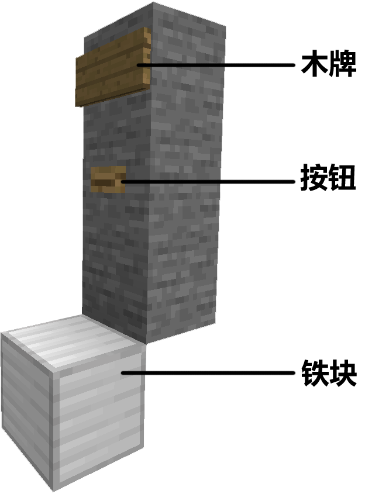
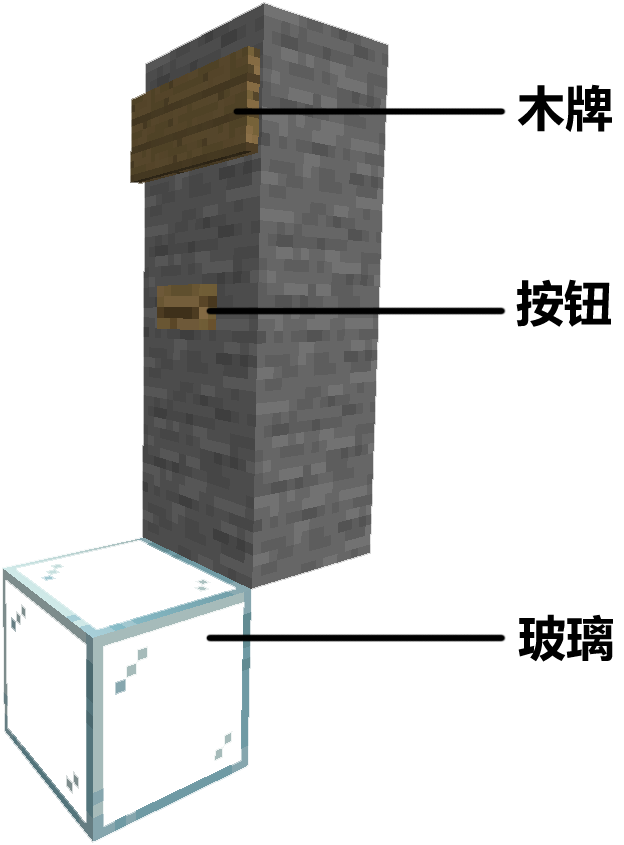

# 建筑辅助类插件

## 画画 

在游戏聊天框中输入 `/artmap` 即可进入画画插件，在操作菜单里查看操作帮助

## 电梯 

玩家可按如下操作自行设置电梯。

使用铁块作为底座（铁块可以为最多 15 格组成的任意形状，同时确保其不接触到其他含铁块的建筑），然后如下所示搭建电梯的第一层：

电梯的第二层（及以上）的设置与第一层相似，仅将铁块替换成玻璃方块即可：

建设完成后，右击每层的木牌激活电梯。站在铁块（玻璃）上右击按钮即可使用电梯，右击牌子选择需要到达的楼层。

## 飞行插件 

因有的建筑过大比较难建筑，服务器对此提供飞行给予一定的便利，飞行的操控方式与创造飞行相同，无掉落伤害。飞行分为一次性飞行和计时飞行两种：一次性飞行为购买后至下线前均有效，掉线不补（服务器维护导致的重启除外）；计时飞行顾名思义，且下线时间不纳入计算，再次上线继续上一次的飞行。

由于游戏版本升级导致计时飞行的计时插件失效，目前只提供 800D 一次的一次性飞行。

## 头颅商店 

**建筑师专属**：使用 `/menu` 即可进入

