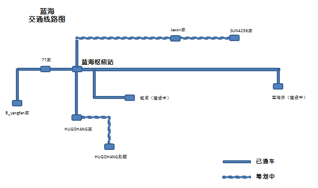
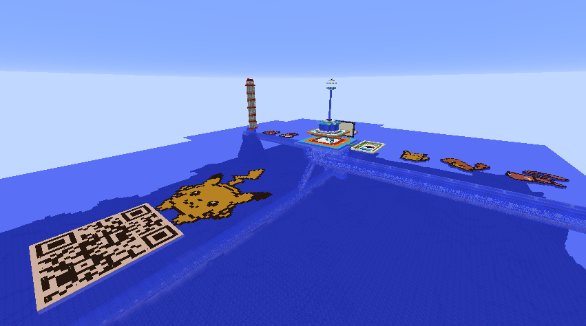
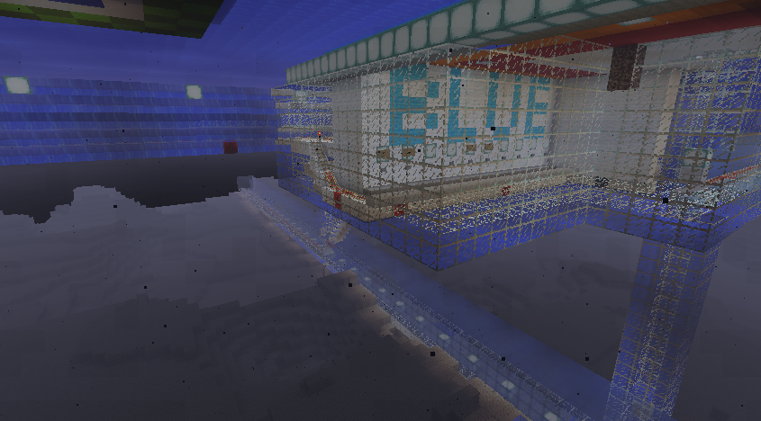
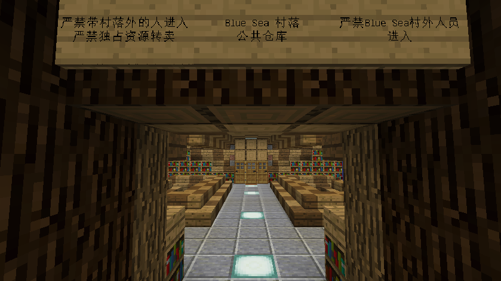
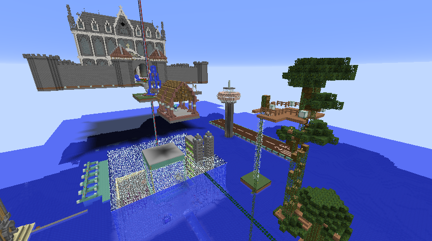
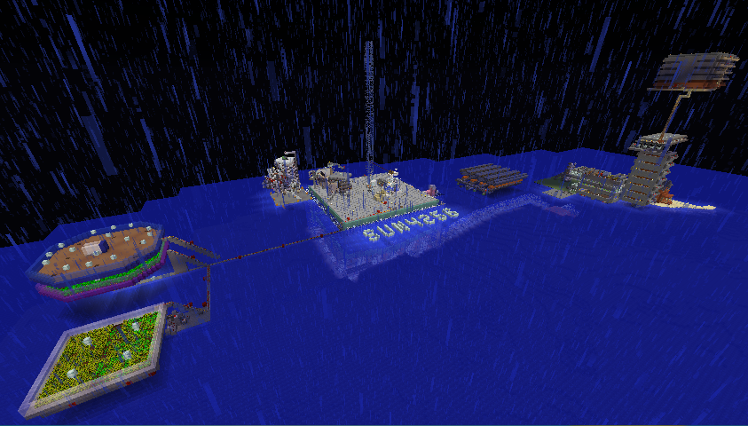

# 蓝海村

## 简介

* 类型：玩家村落
* 范围：\(-5300 , -3200\)—\(-3500 , -4500\)
* 村长：HUGOHANG

蓝海村（**Blue Sea**），位居出生点西北方，为本服第一个出现的村落。

建筑风格为海上村落，主要建筑均座落于海上。

海浪起伏，繁花似锦，自由的建筑风格，尚在开荒期的小小港湾，欢迎建筑系玩家入驻共同打造海上城市。

> * 甲：知道海水为什么是蓝色的吗？
> * 乙：为什么？
> * 甲：因为海里有鱼。
> * 乙：为什么有鱼海水就是蓝色的呢？
> * 甲：因为鱼会吐泡泡。
> * 乙：为什么鱼吐泡泡海水就是蓝色的呢？
> * 甲：因为鱼吐泡泡的声音是哺噜\(blue\)哺噜\(blue\)。

## 加入条件

常驻玩家，并且拥有 1000 D 以上的存款。

## 交通线路图

## 村落内玩家建筑

### 传送中心

### 枢纽车站

### 村落共享仓库

### HUGOHANG 家

### dealvian 家

### B\_Yangfan 家

### sun4256 家

### 观光建筑（在建）

### 其他建筑一览

