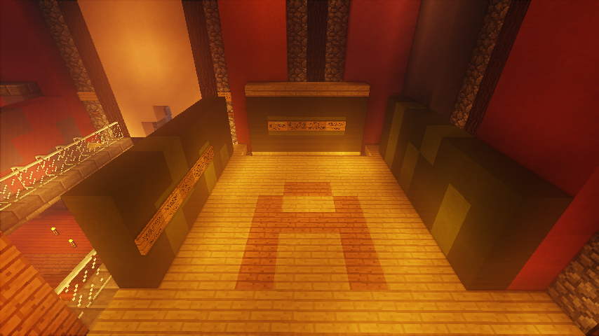

# 萌新新萌结拜制度

为促进新玩家们互相交流，试行萌新新萌结拜制度

## 内容

入服时间小于 60h 的玩家（萌新）与新萌玩家结拜，新萌升级到\[\[世界设定:主世界:玩家权限\|生存家\]\]双方可获得 500D 奖励

## 方式

于主城[公告大厅](https://github.com/ImyvmCircle/wiki/tree/4ccb0e2969ddcc0cd674870d9ca30cd5a2075cdf/shi-jie-she-ding/zhu-shi-jie/shi-jie-she-ding/zhu-shi-jie/buildings.md) 2 楼 A 区立牌为证

## 规则

每位萌新至多可从 3 位成功升级的新萌那里获得奖励。新萌只能跟 1 位萌新结拜，但新萌可以作为萌新与新萌结拜。

具体定义详见论坛：[萌新带新萌鼓励制度试行](https://discuss.imyvm.com/d/8--)

